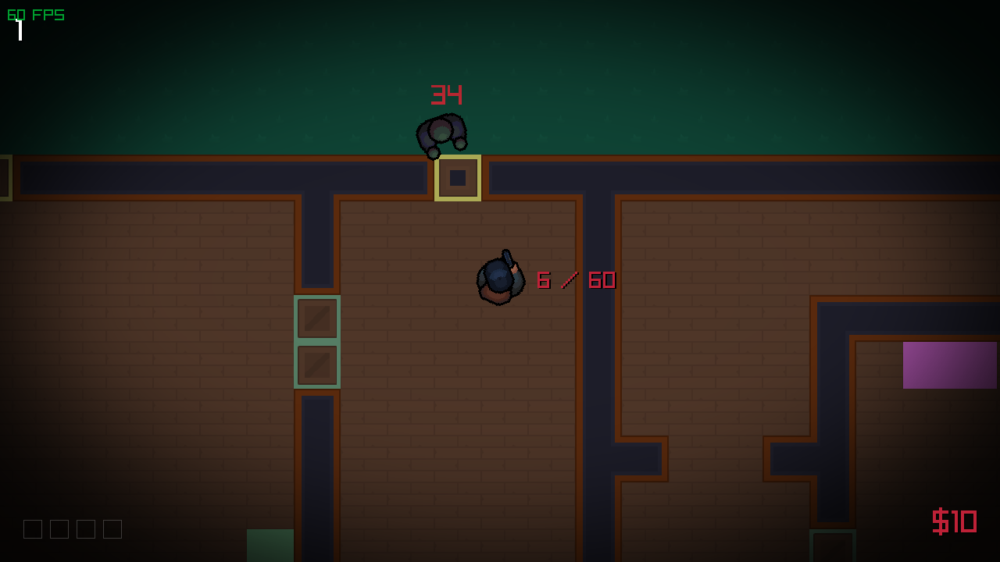
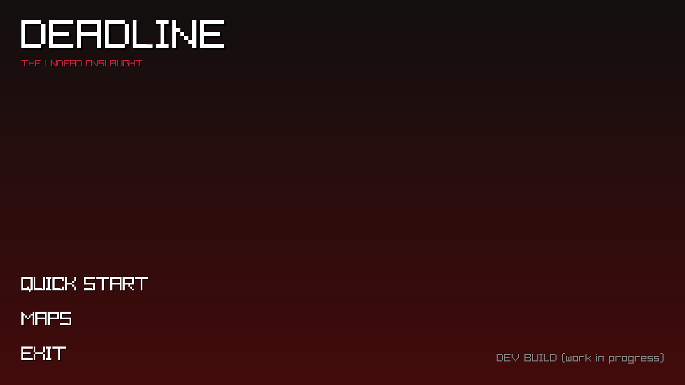
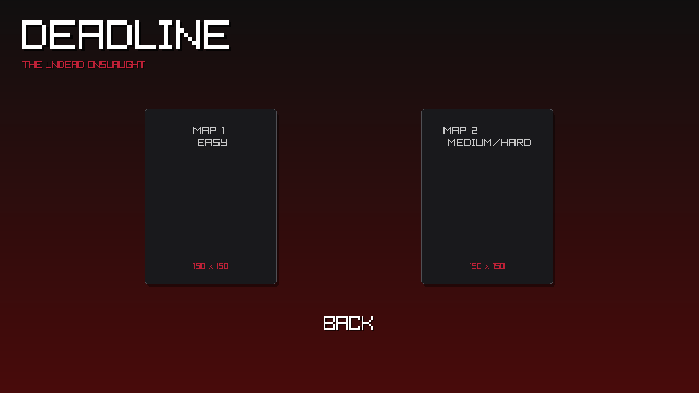

# DEADLINE


<p align="center">
  <strong>Welcome to DEADLINE.</strong>
</p>

Fast-paced, top-down arcade shooter inspired by classic zombie survival modes.

## Play Now

You don't need to compile the project to play it. The game has been compiled to WebAssembly (WASM) and is available to play directly in your browser:

> [!IMPORTANT]
> **Performance Recommendation:**
>
> Due to the game's resource-intensive nature, it is recommended to run the web version on **Map 1** for the best performance. Larger maps contain more assets and may experience frame drops (lag) in browser environments compared to the native desktop build.

**[Play DEADLINE on itch.io](https://asom846.itch.io/deadline)**

_On the itch.io page, you will also find more detailed information about the gameplay rules, and future updates._

## Building the project

### arch linux

If you prefer to build the game locally, follow the instructions below.

```bash
  sudo pacman -Syu --needed git base-devel cmake ninja ccache sccache pkgconf raylib
  git clone https://github.com/ASOM846/DEADLINE.git
  cd DEADLINE
  cmake -S . -B build -G Ninja
  cmake --build build --parallel $(nproc)
```

Run the game using
`./build/DEADLINE`

## Screenshots






